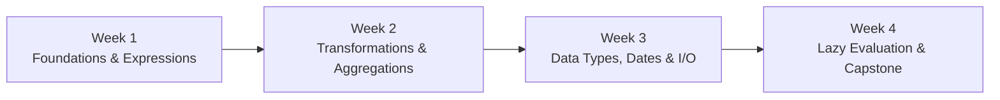

# 🐻‍❄️ Polars Study & Hands-on Practice

A structured repository and 4-week curriculum designed to master **[Polars](https://pola.rs/)** (a lightning-fast DataFrame library built on Apache Arrow in Rust) with a daily commitment of **~1 hour per day**.

---

## 🚀 Quick Start

### 1. Environment & Prerequisites
This repository uses a pre-configured Python virtual environment with Polars `v1.44.2`.

```bash
# Clone the repository
git clone git@github.com:dikshie/polars_study.git
cd polars_study

# Activate virtual environment
source bin/activate

# Verify installation
python -c "import polars as pl; print(f'Polars Version: {pl.__version__}')"
```

> **Direct execution**: You can also run any script directly using `./bin/python <script.py>`.

---

## 📚 4-Week Study Curriculum

The full day-by-day learning roadmap, code snippets, and daily exercises are documented in **[STUDY_PLAN.md](STUDY_PLAN.md)**.



### 🗓️ Week 1: Foundations & The Expression System
- **Day 1**: Polars Architecture, Series & DataFrames, Columnar Storage
- **Day 2**: Selection & Projection (`select`, `pl.col`)
- **Day 3**: Adding & Modifying Columns (`with_columns`)
- **Day 4**: Row Filtering (`filter`, boolean predicates)
- **Day 5**: Branching Logic (`when().then().otherwise()`)
- **Day 6**: Sorting (`sort`) and Deduplication (`unique`)
- **Day 7**: Weekly Review & Data Cleaning Challenge

### 🗓️ Week 2: Transformations, Aggregations & Joins
- **Day 8**: Group By & Basic Aggregations (`group_by().agg()`)
- **Day 9**: Advanced Aggregations (Lists & Conditional aggregations)
- **Day 10**: Window Functions (`.over()`) without costly joins
- **Day 11**: Joining DataFrames (`inner`, `left`, `semi`, `anti`)
- **Day 12**: DataFrame Concatenation (`concat`: vertical, horizontal, diagonal)
- **Day 13**: Reshaping Data (`pivot` & `unpivot`)
- **Day 14**: Sales & Inventory Analytics Mini-Project

### 🗓️ Week 3: Data Types, Strings, Dates & I/O
- **Day 15**: Handling Missing Data & Nulls (`fill_null`, `is_null`, `drop_nulls`)
- **Day 16**: String Manipulation (`.str`) & Categoricals (`.cast(pl.Categorical)`)
- **Day 17**: Temporal & DateTime Operations (`.dt`, time zones, offsets)
- **Day 18**: Fast File I/O with CSV & JSON (`read_csv`, `scan_csv`, `read_json`)
- **Day 19**: High-Performance Storage with Parquet & Compression
- **Day 20**: Arrow, Pandas, and NumPy Interoperability
- **Day 21**: Weekly ETL & Normalization Drill

### 🗓️ Week 4: Lazy Evaluation, Optimization & Capstone
- **Day 22**: LazyFrames (`scan_*`), Query Plans & `.explain()`
- **Day 23**: Out-of-Core Streaming Engine (`engine="streaming"`)
- **Day 24**: Pandas Migration & Polars Idioms (Vectorization vs `map_elements`)
- **Day 25**: Polars SQL Context (`pl.SQLContext()`)
- **Day 26–27**: Capstone Project: End-to-End Large-Scale Data Pipeline
- **Day 28**: Review, Rust Plugins Overview & Next Steps

---

## ⏱️ Daily 1-Hour Study Routine

| Time | Activity | Focus |
| :--- | :--- | :--- |
| **00 – 15m** | **Concept Review** | Read the day's topic in [Polars Official Docs](https://docs.pola.rs/) |
| **15 – 40m** | **Interactive Coding** | Run and modify the daily sample code in Python |
| **40 – 60m** | **Hands-On Exercise** | Solve the daily mini-challenge and verify results |

---

## 💡 Key Polars Principles

1. **Expressions over Loops**: Everything runs in parallel across CPU cores by composing expressions using `pl.col()`.
2. **Lazy by Default for Big Data**: Use `pl.scan_parquet()` / `pl.scan_csv()` to enable query optimizations like projection pushdown and predicate pushdown before running `.collect()`.
3. **No Index**: Polars relies solely on integer positions and column-based relational operations.
4. **Strict Types**: Eliminates silent type coercion and unexpected `NaN` vs `None` discrepancies.

---

## 📖 Useful References

- [Polars Official Website](https://pola.rs/)
- [Polars User Guide](https://docs.pola.rs/user-guide/)
- [Polars Python API Reference](https://docs.pola.rs/api/python/stable/reference/index.html)
- [Polars Plugins Tutorial](https://marcogorelli.github.io/polars-plugins-tutorial/)
- [Apache Arrow Documentation](https://arrow.apache.org/)

---

## 👤 Author
- **dikshie fauzie** ([@dikshie](https://github.com/dikshie))
- Email: `dikshie@gmail.com`
